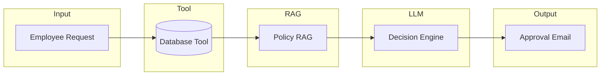

# Corporate Vacation AI Agent


An enterprise-style AI agent that automates corporate leave approvals using **Tool + RAG** integration. The system combines deterministic data validation with LLM-based policy reasoning to produce explainable, policy-compliant decisions.

---

## Why This Project

Vacation approvals are often slow and inconsistent because of document-heavy policies, manual balance checks, and unclear rejection reasons. This project demonstrates how an AI agent can:

- **Separate facts from reasoning** — balances from tools, rules from retrieved policy
- **Stay explainable** — every decision cites policy and data
- **Keep humans in control** — manager notifications and clear alternatives

---

## Architecture



**Design principle:** The LLM never “guesses” facts — all balances come from tools, all rules from retrieved policy context.

| Layer | Role |
|-------|------|
| **Database Tool** | Real-time leave balance, employee lookup, quota enforcement (SQLite) |
| **Policy RAG** | Vectorized policy retrieval (ChromaDB); enforces 60% rule, blackouts, notice period, frequency limits |
| **LLM** | Combines tool outputs + retrieved policy → approve/reject with explanation |
| **Output** | Manager-ready approval email, remaining balance, alternatives |

---

## Core Capabilities

- **Tool integration** — SQLite balance checks, annual quotas, historical usage
- **Policy reasoning** — Business rules enforced via RAG (60% max per request, blackout periods, notice requirements)
- **Conversational UX** — Multi-step validation, policy-cited rejections, proactive date alternatives
- **Workflow automation** — Manager notifications, request tracking

---

## Example Interaction

**Request:** *"I want to take 5 vacation days starting Feb 15."*

**Approved:** *"Approved. Your request complies with policy. Remaining balance: 5 days. Manager notified."*

**Rejected:** *"Rejected. Exceeds 60% rule (Section 2.1). You may request up to 4 days or adjust dates."*

---

## Tech Stack

- **Python** · **LangChain** · **OpenAI API**
- **ChromaDB** (vector store) · **SQLite** (balances & employees)
- **Streamlit** (web UI)

---

## Project Structure

```
corporate-vacation-agent/
├── data/
│   ├── company_policy.md    # Policy document
│   ├── employee_data.db     # SQLite DB
│   └── chroma_db/           # Vector store
├── src/
│   ├── database_tool.py     # Balance checks
│   ├── policy_rag.py        # Policy retrieval
│   └── vacation_agent.py     # Agent orchestration
├── streamlit_app.py         # Web UI
├── main.py                  # CLI demo
└── USER_GUIDE.md            # Architecture & usage details
```

---

## Quick Start

```bash
pip install -r requirements.txt
export OPENAI_API_KEY=your_key_here
streamlit run streamlit_app.py
```

Web UI: **http://localhost:8501**

---

## What This Demonstrates

- **AI system design** — Tool-first, RAG-second; clear separation of data vs. reasoning
- **Safe LLM use** — Deterministic guardrails; no hallucinated balances or rules
- **End-to-end ownership** — Data pipeline → RAG → agent logic → UX
- **Explainability** — Every decision tied to policy sections and balance data

For detailed architecture, policy examples, and runbooks see **[USER_GUIDE.md](USER_GUIDE.md)**.

---

## Possible Extensions

HRIS integrations (Workday, BambooHR), multi-level approvals, audit logs, Slack/Teams interface, HR analytics dashboard.
